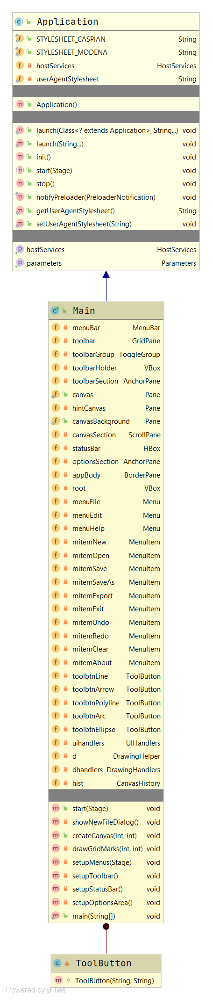
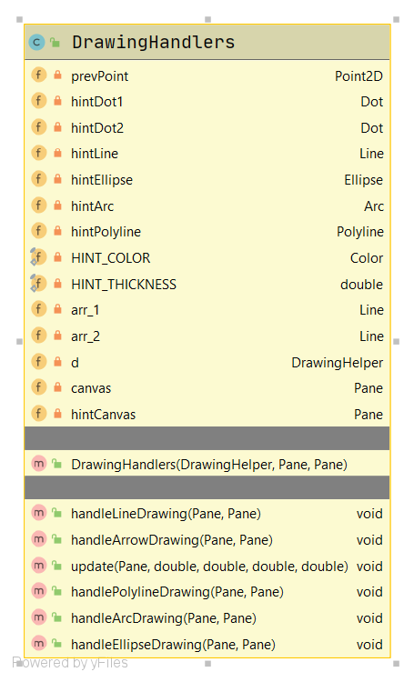
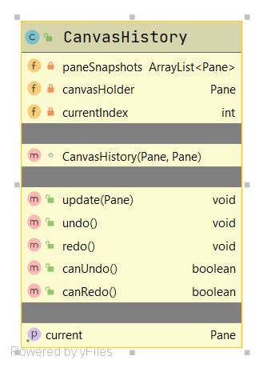
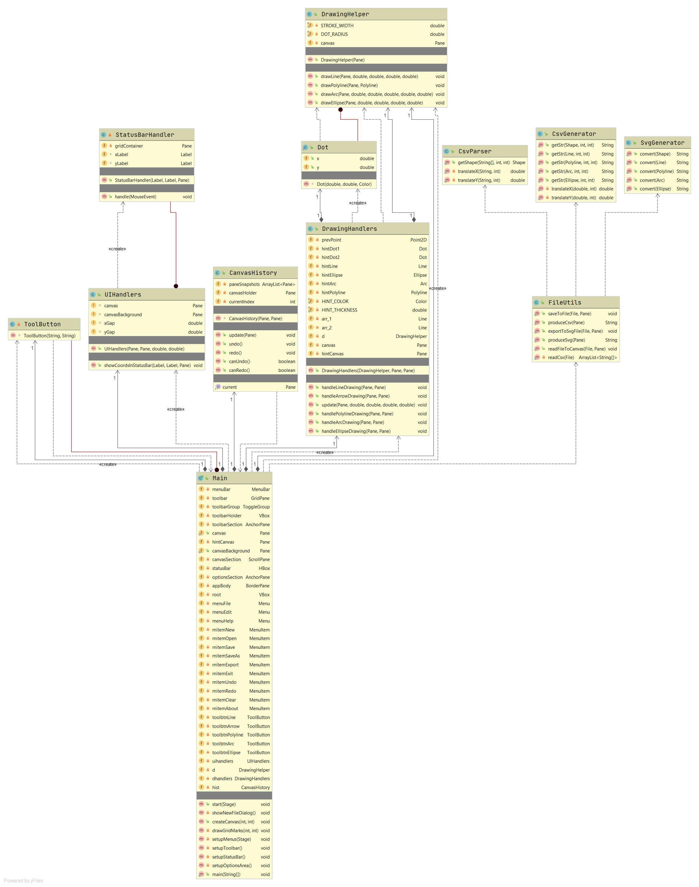

# JDrawpad

**JDrawpad** is an application for designing vector graphics.

It lets the user interactively draw simple vector shapes on a rectangular canvas using a pointing device.
It provides facilities for saving an artwork and opening an existing artwork, as well for saving an artwork to a universal graphic file format (Scalable Vector Graphic or SVG).

## Structure

### Classes

The main JavaFX application class:
- `Main` (extends `javafx.application.Application`)

Helper classes:
- *Classes for helper objects*
  - `DrawingHelper`
  - `CanvasHistory`
- *Classes defining event handlers*
  - `UIHandlers`
  - `DrawingHandlers`
- *Classes defining utility functions*
  - `FileUtils`
  - `CsvGenerator`
  - `CsvParser`
  - `SvgGenerator`

Relationship between the top-level classes:

### Descriptions of the classes

#### Class: `Main`

Every JavaFX program must have a class that extends `javafx.application.Application` and overrides its `start(Stage primaryStage)` method.
`primaryStage` represents the primary window in the application.
When a JavaFX application starts up, it creates a root `Stage` (GUI window) object which is passed to the `start(Stage primaryStage)` method of the root class (that extends `Application`) in the JavaFX application.
In our program, `Main` serves the purpose of the root class.
We are also using it to perform the primary UI-related operations.

Inner class: `ToolButton`.
Represents a tool button.
It’s a subclass of JavaFX’s `ToggleButton`, so that if it’s included in a `ToggleGroup`, only one of the buttons in that `ToggleGroup` can be selected at a time at most.
The `ToggleGroup` for our toolbar buttons is the field `toolbarGroup`.

#### Class: `UIHandlers`

This class defines event handlers for some UI elements.

#### Class: `DrawingHelper`

This class defines functions that perform the actual drawing commands as well as the related (inner) classes.

#### Class: `DrawingHandlers`

This class defines the event-handler objects that are triggered when user interacts with the canvas using a pointing device while a tool is selected.

#### Class: `CsvGenerator`

This class defines methods that produce a comma-separated representation from a shape object to be written to the JDP file (a CSV format).

#### Class: `SvgGenerator`

This class defines methods that produce SVG code from a shape.

#### Class: `CsvParser`

This class defines methods that produce shape objects from a each line from the JDP file (CSV format).

#### Class: `FileUtils`

This class defines the utility methods for reading and writing files.

#### Class: `CanvasHistory`

The `CanvasHistory` class represents the timeline of the canvas.
JDrawpad uses a `CanvasHistory` for its undo-redo functionality.

### How the classes work together

